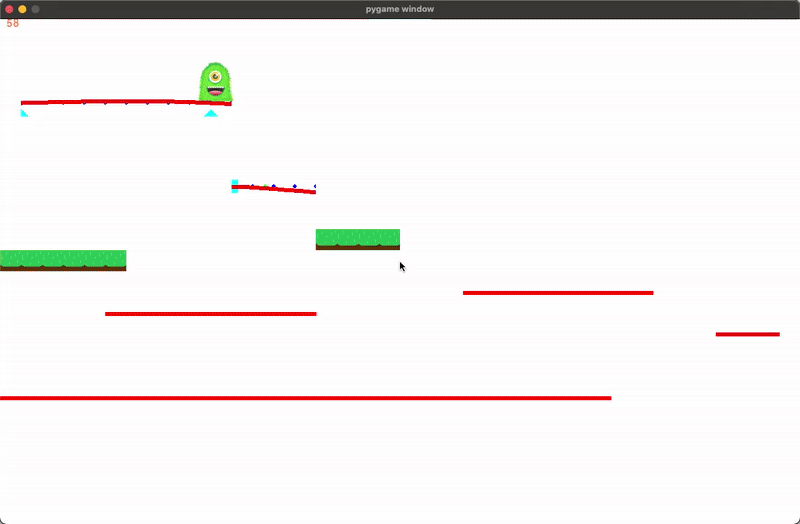

# Pygame Flexible Beam Side Scroller

Platform Side Scroller where all the platforms are bendy. Using Pygame

# Technologies

- Pygame for the game physics. This includes cantilever, simply spanning and continuous beams.
- Real engineering physics with [Anastruct](https://anastruct.readthedocs.io) python library
